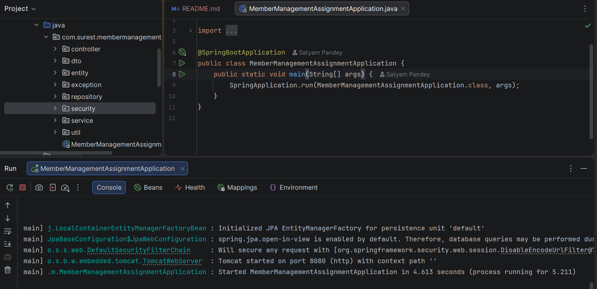
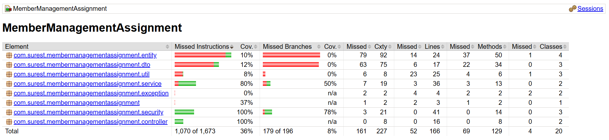

# Member Management Assignment

## 📌 Overview
Spring Boot backend application for managing members with secure REST APIs.
Built as part of a backend assignment focusing on clean architecture, security, and testing.

## 🚀 Features
- Member CRUD operations
- Pagination & sorting
- Validation & global exception handling
- Spring Security integration
- Unit, integration & security tests
- Code coverage with JaCoCo

## 🛠 Tech Stack
- Java 17
- Spring Boot 3.x
- Spring Data JPA
- Spring Security
- Gradle
- JUnit 5, MockMvc
- JaCoCo

### Application Running

### Code Coverage
